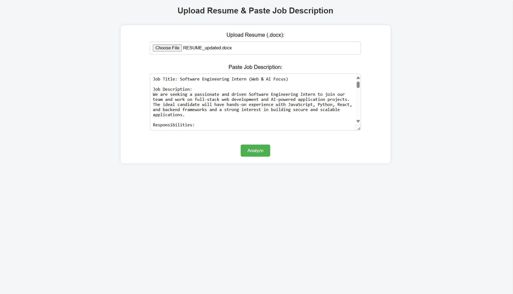
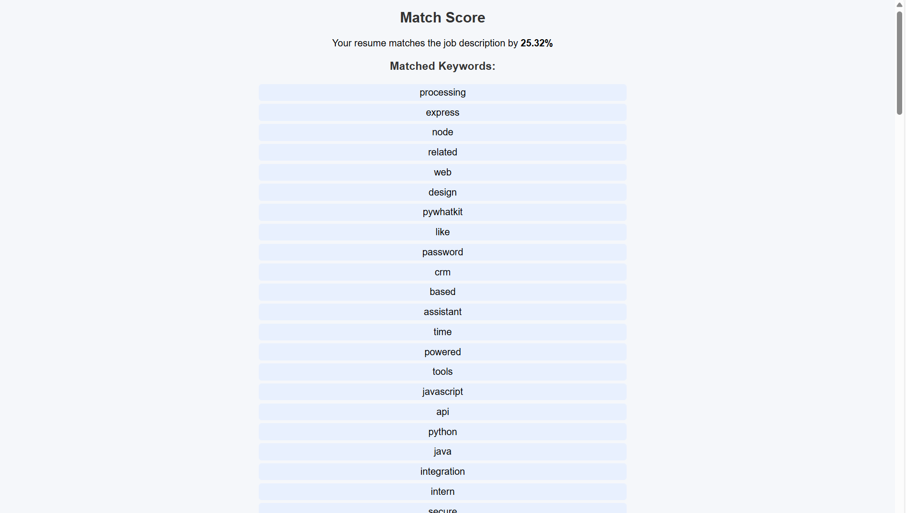

📝 AI Resume Screener
AI Resume Screener is a Flask-based web application that helps users analyze their resumes against a job description.
It uses TF-IDF (Term Frequency – Inverse Document Frequency) and Cosine Similarity to calculate a match score and identify matched and missing keywords.

🚀 Features
Upload your resume in .docx format

Paste the job description directly into the form

Get a match score (0-100%) based on similarity

Identify matched and missing keywords to improve your resume

Clean and minimal web interface

📸 Screenshots

Home Page: Shows the upload and job description form  

Results Page: Displays the match score and keywords  

⚙️ Installation & Setup
Clone the Repository
Open a terminal and run:
git clone https://github.com/krish10007/AI_Resume_Screener.git
cd AI_Resume_Screener

Create and Activate Virtual Environment

Windows:
python -m venv venv
venv\Scripts\activate

Mac/Linux:
python3 -m venv venv
source venv/bin/activate

Install Dependencies
pip install -r requirements.txt

Run the Application
python app.py

Open in Browser
http://127.0.0.1:5000

📂 Project Structure
AI_Resume_Screener/
├── static/ – CSS files (style.css)
├── templates/ – HTML templates (index.html, result.html)
├── app.py – Flask backend
├── requirements.txt – Python dependencies
└── README.md – Project documentation

🧠 How It Works
Extracts text from the uploaded resume (.docx)

Converts both resume and job description to TF-IDF vectors

Calculates cosine similarity to determine match percentage

Identifies matched and missing keywords for optimization

Displays results in a simple, clean web interface

💡 Future Improvements
Add PDF resume support

Deploy the app to Heroku or AWS for live access

Add synonym and weighted keyword scoring for better accuracy

🏆 Author
Krish Jakhar
Computer Science Undergrad | Aspiring Software Engineer
GitHub: https://github.com/krish10007

